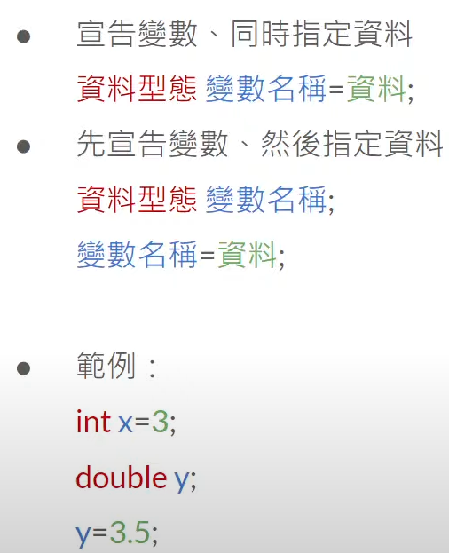

# Java Basic

## 開始

Java 是一種物件導向程式語言，誕生於1995年，並廣泛應用於桌面應用程式、網站應用程式和行動應用程式。

以下是一些 Java 的基本語法：

編譯 Java 程式：
```
javac 檔名.java
```

執行 Java 程式：
```
java 檔名
```

請注意，檔名必須與類別名稱相同。

下面是一個簡單的 Java 程式範例：

```java
public class 類別名稱 {
    public static void main(String[] args) {
        // 程式進入點
    }
}
```

註解：
```java
// 但行註解

/*
  多行註解
*/
```

## 資料型態

1. 整數: `byte`, `short`, `int`, `long`
    - `byte`:   -128 ~ 127
    - `short`:  -32768 ~ 32767
    - `int`:    -214748364 ~ 2147483647
    - `long`:   -9223372036854775808 ~ 9223372036854775807

2. 浮點數: `float`, `double`
    - `float`: 精準到小數點後7位數
    - `double`: 精準到小數點後15位數

3. 布林值: `boolean`
    - `boolean`: `true` 或 `false`

4. 字元: `char`
    - `char`: 使用單引號包住一個字

5. 字串: `String`
    - `String`: 使用雙引號包住一串文字

## 變數

用來儲存資料的名稱，可以用變數名稱帶替資料進行操作。

宣告變數的語法：
```
資料型態 變數名稱;
```

範例：
```
int x;
double y;
boolean z;
char c;
String s;
```

指定資料
